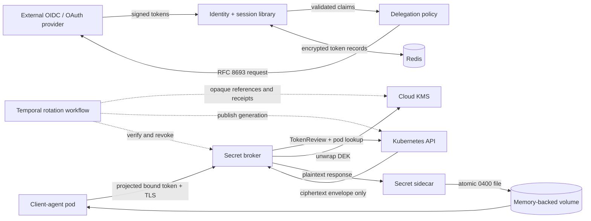
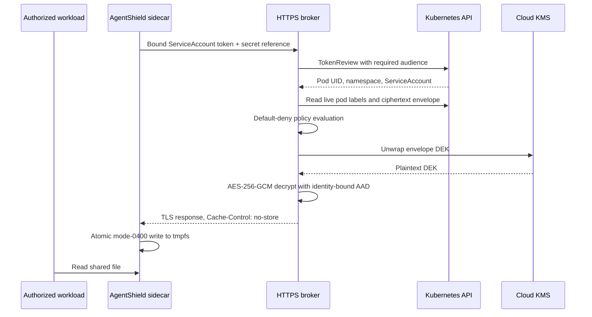
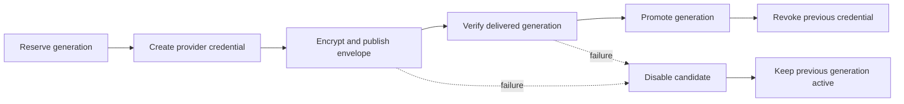

# AgentShield

**Identity, delegated authority, and ciphertext-only secret delivery for client agents.**

[](https://github.com/mailtotanvir/Agent-Shield/actions/workflows/ci.yml)


Agent workloads need credentials, but handing them long-lived bearer tokens or
plaintext Kubernetes Secrets expands the blast radius of every compromised pod.
AgentShield is a working security prototype that narrows that boundary:

- strict OIDC/JWT validation and PKCE session handling;
- policy-constrained RFC 8693 token exchange without becoming a token issuer;
- DPoP proof-of-possession for high-sensitivity operations;
- encrypted refresh-token custody with replay-aware token families;
- KMS envelope encryption and authenticated, policy-bound secret delivery; and
- optional Temporal orchestration for durable secret rotation.

The project has been exercised on disposable Kubernetes and GKE environments.
Cloud validation demonstrated real GKE Workload Identity, Cloud KMS
encryption/decryption, authorized delivery into a RAM-backed volume, and denial
of an unauthorized workload. It is deliberately not presented as production
ready.

## Evidence at a glance

| Signal | Result |
|---|---:|
| Automated tests | 46 passed |
| Branch coverage | 73.34% |
| Authorized GKE delivery | Matching SHA-256 digest |
| Unauthorized GKE request | HTTP 403 |
| Cloud security checks | Ruff, strict mypy, Bandit, Semgrep, pip-audit, Trivy |

Read the [cloud evidence summary](docs/evidence/gcp-r6-summary.md), the
[threat model](docs/threat-model/STRIDE.md), or the
[accepted design decisions](design.md).

## Architecture



The key distinction is where plaintext may exist. Kubernetes stores policy and
an encrypted envelope; it does not receive the secret value. Plaintext exists
briefly in the ingestion process, broker process memory, sidecar process memory,
and the destination pod's RAM-backed volume. Python cannot guarantee complete
memory zeroization, and a privileged node or cluster administrator remains
inside the trusted computing base.

## Secret-delivery path



An unauthorized identity is rejected before decryption. The broker does not
trust caller-provided labels: it resolves the live pod and checks its UID,
namespace, ServiceAccount, and selectors.

## Durable rotation with Temporal

Temporal is used for long-running coordination, not request-path authorization.
Workflow history contains opaque references, versions, ciphertext digests, and
receipts—never plaintext, tokens, private keys, or authorization headers.



The OCI suite exercises retry, idempotency, compensation, replay, and a history
scan proving that a generated canary does not enter Temporal history. Running a
production Temporal service is intentionally deferred.

## Security boundaries

AgentShield is:

- an OAuth/OIDC client and strict verifier;
- a policy layer around externally issued tokens and RFC 8693 exchange;
- a Kubernetes operator, broker, and explicit sidecar; and
- an optional durable rotation coordinator.

AgentShield is not:

- an identity provider or authorization server;
- a token issuer or signing-key authority;
- a general-purpose secret manager;
- a service mesh, CSI driver, or admission controller; or
- a production-ready highly available control plane.

External identity providers own signing, JWKS publication, rotation, and
recovery. AgentShield owns strict verification, least-authority policy, secure
delivery, failure behavior, and redacted evidence.

## Controls implemented

| Boundary | Implemented controls |
|---|---|
| OIDC login | Discovery pinning, PKCE S256, state, nonce, exact issuer/audience |
| JWT/JWKS | RS256/ES256 allowlist, bounded fetches, `kid` refresh, algorithm-confusion defenses |
| Delegation | Scope intersection, audience allowlists, lifetime caps, post-exchange validation |
| DPoP | ES256 proofs, `htu`/`htm`/`iat`/`jti`/`ath`, thumbprint binding, replay rejection |
| Refresh custody | KMS envelope encryption, compare-and-swap leases, family compromise handling |
| Kubernetes identity | Audience-bound TokenReview, pod UID/ServiceAccount/label verification |
| Secret storage | AES-256-GCM envelope; only ciphertext and wrapped DEK enter Kubernetes objects |
| Delivery | TLS broker, explicit sidecar, atomic file replacement, RAM-backed `emptyDir` |
| Audit | Structured reason codes, fingerprints, recursive redaction, hash chaining |
| Rotation | Temporal retries, compensation, idempotency, and reference-only workflow history |

The complete abuse-case inventory is in the
[STRIDE threat model](docs/threat-model/STRIDE.md).

## Try it safely

Requirements: Python 3.12, [uv](https://docs.astral.sh/uv/), Docker, kubectl,
kind, and Helm.

```bash
uv sync --frozen --extra dev
uv run pytest --cov=agentshield
uv run ruff check .
uv run mypy agentshield
```

The disposable local Kubernetes proof uses a deterministic fake KMS adapter and
synthetic canary data:

```bash
./scripts/kind-smoke.sh
```

The script creates and deletes its kind cluster automatically. The GCP evidence
runners are historical, one-shot experiment artifacts—not general deployment
scripts. They require an explicit `AGENTSHIELD_GCP_PROJECT` and revision-specific
approval token and must not be run casually.

## Repository map

```text
agentshield/
├── identity/       OIDC, Google OIDC, and IAP validation boundaries
├── authz/          delegation policy and RFC 8693 client
├── session/        JWT/JWKS, DPoP, revocation, and encrypted token vault
├── secrets/        envelope encryption, KMS adapter, broker, operator, sidecar
├── workflows/      Temporal rotation workflow
helm/agentshield/   CRD, RBAC, deployments, and network policy
tests/              protocol, adversarial, and Kubernetes tests
docs/evidence/      sanitized validation records and artifact checksums
docs/threat-model/  STRIDE analysis and residual risk
```

## Validation evidence

The cloud validation used a generated high-entropy canary—not a real credential. An encrypt-only
workload published an envelope. A separately identified broker decrypted it,
an authorized sidecar wrote it to tmpfs, and an independent verifier matched the
expected digest. A workload with a different ServiceAccount and label received
HTTP 403.

See the [publication manifest](docs/evidence/run-manifest.json) for checksums and
the [evidence directory](docs/evidence/) for the bounded validation record.

## What remains for production

- high availability, multi-cluster recovery, load and soak testing;
- managed Redis and production Temporal deployment hardening;
- KMS Data Access logging and end-to-end audit correlation;
- live binding-removal, pod-recreation, and key-version failure exercises;
- external immutable audit anchoring and operational alerting;
- additional KMS providers, mTLS-bound tokens, and formal compliance review; and
- packaged releases, upgrade policy, and compatibility guarantees.

These are explicit limitations, not implied capabilities. See
[design.md](design.md#13-deferred-work) for the complete boundary.

## Development and responsible disclosure

All checks run in GitHub Actions. Infrastructure experiments must use synthetic
data and teardown on every exit path. Never commit
cloud project identifiers, account details, tokens, private keys, or live secret
values.

Please report vulnerabilities through GitHub Security Advisories as described
in [SECURITY.md](SECURITY.md).

## License

Apache License 2.0. See [LICENSE](LICENSE).
